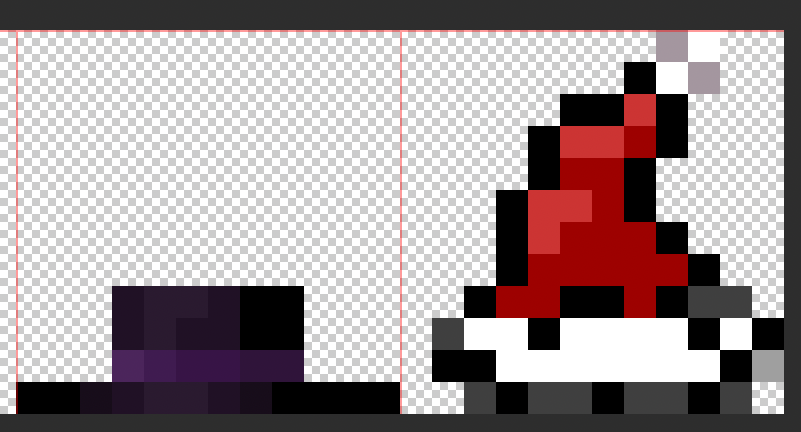
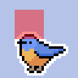

# Custom hats for your pocket bird

This is a companion repo for the [PB-Obsidian-Releases](https://github.com/idreesinc/PB-Obsidian-Releases) repository, and provides instructions for how to add custom hats to your existing local installation of [pocket-bird on Obsidian](https://community.obsidian.md/plugins/pocket-bird).

In this repository you will find my WIP custom hats:

- `main.js` - a copy of the main.js from the plugin, but with my custom nonsense (so far, just a santa hat, cat ears, tangerine, and dubious food)
- `img/hat-spritesheet-base.png` - the png version of the base spritesheet from pocket-bird
- `img/hat-spritesheet-custom.png` - the png version of the spritesheet, but with my custom nonsense (so far, just a santa hat, cat ears, tangerine, and dubious food)
- `img/ref_*.png files` - just images that are used here in the readme documentation

## Making a New Hat

To **create** your own hats, you will need to edit the base64 string of the `HATS_SPRITE_SHEET` const, and then modify the `HATS` and `HAT_METADATA` objects to reference your new hat, all in `main.js`. An example of one such change can be found at [commit f7e275b](https://github.com/cyanliu/pocket-bird-hats/commit/f7e275b6c82f17bf348f0cffddc9459241eb5816).

Your workflow can vary, but mine is as follows:

### Editing the spritesheet + getting the base64 string:

1. Open up the `hats-spritesheet-base.png` file in this repository in any photo editor
   - photopea.com is a great browser-based option
2. Expand the canvas size by 12 additional pixels to create room on the right side
   - The right side is just my preference, you could put it whereever as long as each hat sits within a 12x12 pixel area

     

3. Draw a new hat in this 12x12 px space! 🎩
   - The following picture depicts where the 12x12 area will render on the bird

     

   - Note: The bird + hat are rendered with an additional 1px white outline
   - Note: The "orientation" of the hat in this spritesheet is assuming the bird is facing to the left, while in the wardrobe, the bird + hat faces to the right.

4. Save your png, and then convert it to a base64 string
   - I used [https://base64.guru/converter/encode/image](https://base64.guru/converter/encode/image) and selected the `Data URI -- data:content/type;base64` output format

### Editing the plugin

1. Open the main.js file used by your local installation of pocket-bird
   - e.g. Options > Community Plugins > Installed Plugins > click on the little folder icon
2. Replace the `HATS_SPRITE_SHEET` const with your new base64 value, including the `data:image/png;base64,` prefix.
3. Edit the `HATS` const to include a new custom key-value pair for your hat, corresponding to wherever it is in the spritesheet.
   - e.g. if you added a new hat on the right-most side of the spritesheet, then your new key-value pair should be at the end of the object
4. Edit the `HAT_METADATA` const to reference the new key you made in `HATS`, and then add the name and description that will be rendered in the Wardrobe window
5. Restart Obsidian, and enjoy a new unlockable!
